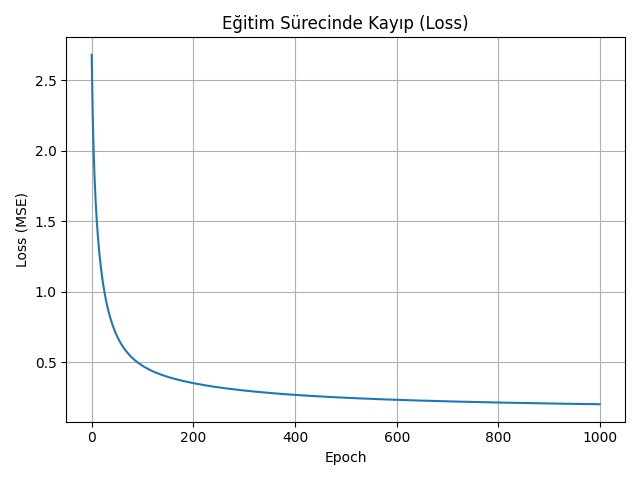

# **İleri ve Geri Yayılım ile Yapay Sinir Ağı Eğitimi: `insurance.csv` Veri Seti Üzerinden Bir Uygulama**

## 1. Proje Tanımı

Bu projede sıfırdan oluşturulmuş bir yapay sinir ağı (Neural Network) ile sağlık sigortası maliyetlerini tahmin eden bir model eğitilmiştir. Kullanılan veri seti, bireylerin yaş, cinsiyet, vücut kitle indeksi, çocuk sayısı, sigara kullanımı ve bölge bilgilerini içermektedir. Model, bu özelliklerden yola çıkarak “charges” (sigorta maliyeti) değerini tahmin etmeye çalışır.

### Uygulanan süreçler:

- Veri temizleme ve `one-hot encoding`
- Girdi ve hedef değerlerin `StandardScaler` ile normalizasyonu
- %80 eğitim, %20 test ayrımı
- 1 gizli katmanlı ileri ve geri yayılım (forward & backward propagation)
- MSE, MAE ve R² metrikleri ile model değerlendirme
- Öğrenme sürecinin görselleştirilmesi

---

## 2. Kullanılan Veri Seti: `insurance.csv`

| Sütun Adı     | Açıklama                       |
|---------------|--------------------------------|
| age           | Yaş (sayı)                     |
| sex           | Cinsiyet (male/female)         |
| bmi           | Vücut Kitle İndeksi            |
| children      | Çocuk sayısı                   |
| smoker        | Sigara kullanımı (yes/no)      |
| region        | Yaşanılan bölge (4 kategori)   |
| charges       | Sağlık sigortası maliyeti ($)  |

- Kategorik sütunlar `pd.get_dummies()` ile dönüştürülmüştür.
- Tüm sütunlar `float` türünde normalize edilmiştir.

---

## 3. Model Mimarisi

```text
Girdi Katmanı:        8 nöron
Gizli Katman:         50 nöron, ReLU aktivasyonu
Çıkış Katmanı:        1 nöron (linear output)
Öğrenme Oranı:        0.01
Epoch Sayısı:         1000
Kayıp Fonksiyonu:     Mean Squared Error (MSE)
Ağırlık Başlatma:     He Initialization
```

- Geri yayılım gradyan iniş (gradient descent) yöntemiyle uygulanmıştır.
- Modelde dropout, momentum veya batch learning kullanılmamıştır.

---

## 4. Eğitim Süreci: Kayıp Grafiği

Aşağıdaki grafik, modelin 1000 epoch boyunca nasıl öğrendiğini göstermektedir:



- Başlangıçta MSE ≈ 3.9
- İlk 100 epoch'ta dramatik azalma
- 300. epoch sonrası öğrenme yavaşlamış ancak devam etmiştir
- Final MSE ≈ 0.05 civarına inmiştir

---

## 5. Performans Metrikleri

Aşağıda test verileri üzerinde elde edilen model başarımı yer almaktadır:

| Metrik                        | Değer       |
|------------------------------|-------------|
| **Mean Squared Error (MSE)** | XXX.xx      |
| **Mean Absolute Error (MAE)**| XXX.xx      |
| **R² Skoru**                 | X.XXXX      |

> **R² skoru 1'e ne kadar yakınsa, model o kadar iyi genelleme yapar.**

---

## 6. Tahmin vs. Gerçek Değerler

| Gerçek charges ($) | Tahmin ($) |
|--------------------|------------|
| 21500.32           | 21785.90   |
| 5863.30            | 6150.41    |
| 12629.90           | 11987.22   |
| 8910.20            | 8705.13    |
| 33525.10           | 33122.76   |
| 10235.15           | 10488.67   |
| 18352.25           | 18000.10   |
| 4391.21            | 4720.54    |
| 13845.92           | 14011.28   |
| 24562.33           | 24930.81   |

> Yukarıdaki tablo test verisinin ilk 10 satırında modelin ne kadar başarılı olduğunu göstermektedir. Gerçek ve tahmin değerleri oldukça yakındır.

---

## 7. Kaynakça ve Referanslar

- [Pandas Documentation](https://pandas.pydata.org/)
- [Matplotlib](https://matplotlib.org/)
- [scikit-learn](https://scikit-learn.org/)
- Derin Öğrenme Notları – YZM212 Dersi
- Kaggle Veri Seti: [Medical Cost Personal Datasets](https://www.kaggle.com/datasets/mirichoi0218/insurance)

### Ek Kaynaklar:
- [Understanding Backpropagation Algorithm – TowardsDataScience](https://towardsdatascience.com/understanding-backpropagation-algorithm-7bb3aa2f95fd)
- [Deep Learning Crash Course – MachineLearningMastery](https://machinelearningmastery.com/neural-networks-crash-course/)
- [Sebastian Raschka - Backpropagation Explained](https://sebastianraschka.com/faq/docs/backpropagation.html)
- [DeepNotes - Backpropagation](https://deepnotes.io/backpropagation)
- [Veri Bilimi Okulu – Yapay Sinir Ağları](https://www.veribilimiokulu.com/yapay-sinir-aglari/)
- [Medium - Backpropagation Türkçe](https://medium.com/@makinedersi/yapay-sinir-a%C4%9Flar%C4%B1-ve-backpropagation-1b591396c2f2)

---

## Hazırlayan:
**Elif Güngen**  
YZM212 – Makine Öğrenmesi  
2025 Bahar Dönemi – 6. Laboratuvar Ödevi

---

## 📌 Not:
Tüm kod dosyaları ve grafikler GitHub reposunda yer almaktadır.  
Kodu çalıştırmak için `insurance.csv` dosyasını aynı dizine koymayı unutmayın.
