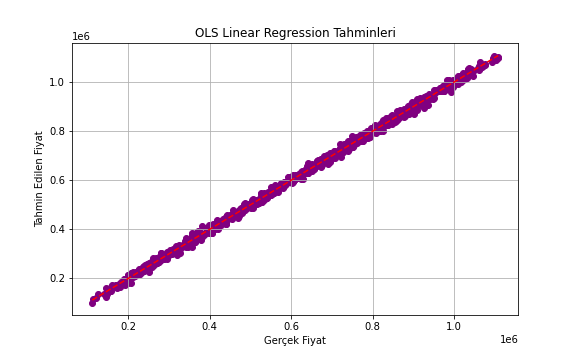
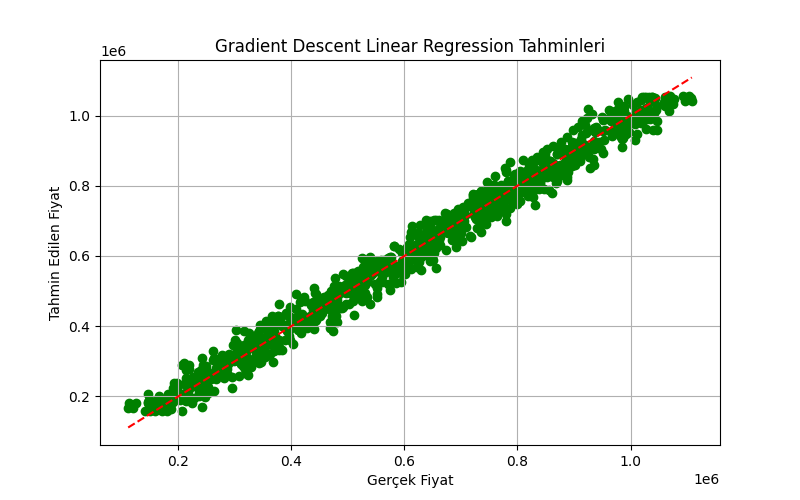

# YZM212 - Makine Öğrenmesi Lab 4: Linear Regression

## 📌 Proje Amacı
Bu laboratuvar çalışmasında, ev fiyatlarını tahmin etmeye yönelik iki farklı lineer regresyon modeli eğitilmiştir:
1. **OLS (Ordinary Least Squares)** yöntemiyle kapalı form regresyon
2. **Gradient Descent (GD)** yöntemiyle iteratif regresyon

Amaç, aynı veri seti üzerinde bu iki yaklaşımın başarımını karşılaştırarak optimizasyon farklarını ortaya koymaktır.

---

## 🧾 Kullanılan Veri Seti
`house_price_regression_dataset.csv` adlı veri seti kullanılmıştır. Veri seti, aşağıdaki değişkenleri içermektedir:

- `Square_Footage`  
- `Num_Bedrooms`  
- `Num_Bathrooms`  
- `Year_Built`  
- `Lot_Size`  
- `Garage_Size`  
- `Neighborhood_Quality`  
- `House_Price` (target/etiket)

Veri seti, benzetim (simülasyon) yoluyla oluşturulmuş olup, gerçek bir kaynağa dayanmamaktadır. Ancak yapısı, konut fiyat tahmini çalışmalarında sıkça kullanılan Kaggle veri setlerine benzerdir.

---

## 🛠 Model 1 – OLS Linear Regression (Kapalı Form)
### Kullanılan Formül:
\[
\beta = (X^T X)^{-1} X^T y
\]

Model, NumPy ile manuel olarak kodlanmış ve aşağıdaki sonuçlar elde edilmiştir:

- **MSE (Mean Squared Error):** `95.249.090`
- **Görselleştirme:**

---

## 🔁 Model 2 – Gradient Descent ile Linear Regression
### Kullanılan Güncelleme Kuralı:
\[
\theta = \theta - \alpha \cdot \frac{1}{m} X^T (X\theta - y)
\]

Model 1000 epoch boyunca çalıştırılmış, öğrenme oranı `1e-8` olarak belirlenmiştir.

- **Final Cost:** `548.227.117`
- **MSE (Mean Squared Error):** `1.096.454.234`
- **Görselleştirme:**

---

## 🔍 Sonuç ve Yorum
- OLS yöntemi, kapalı formda çözüm sunduğu için **daha hızlı ve daha düşük maliyetli** bir sonuç üretmiştir.
- Gradient Descent ise doğru yapılandırılmasına rağmen, **daha yüksek MSE değeriyle** modelin veri üzerinde daha az isabetli tahmin yaptığını göstermektedir.
- GD yöntemi iyileştirilebilir: öğrenme oranı, epoch sayısı, feature scaling gibi işlemlerle model başarımı artırılabilir.
- Yine de her iki yöntem de temel lineer regresyonu başarıyla uygulamaktadır.

---

## 📁 Klasör Yapısı

---

## 📚 Kaynaklar
- [Linear Regression - Wikipedia](https://en.wikipedia.org/wiki/Linear_regression)
- [Gradient Descent Explained](https://towardsdatascience.com/gradient-descent-algorithm-and-its-variants-10f652806a3)
- [Kaggle - House Prices: Advanced Regression Techniques](https://www.kaggle.com/competitions/house-prices-advanced-regression-techniques/)

---

## 📌 Not
Bu çalışma, Ankara Üniversitesi YZM212 Makine Öğrenmesi dersi kapsamında hazırlanmıştır.

